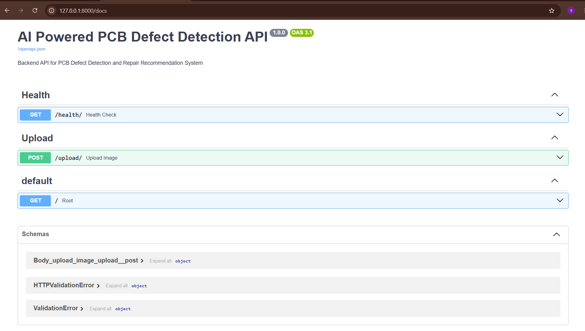
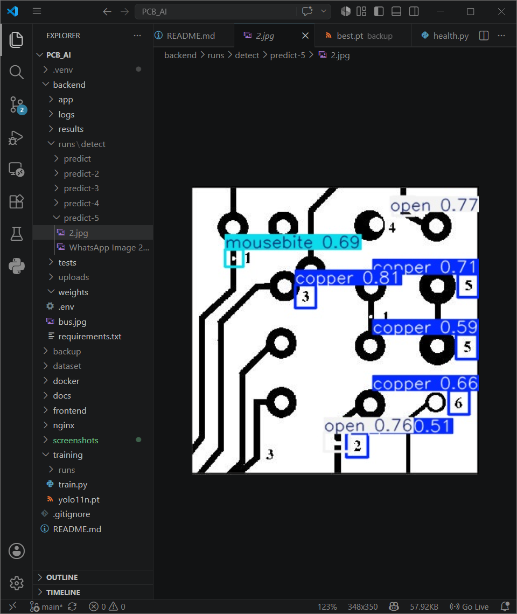
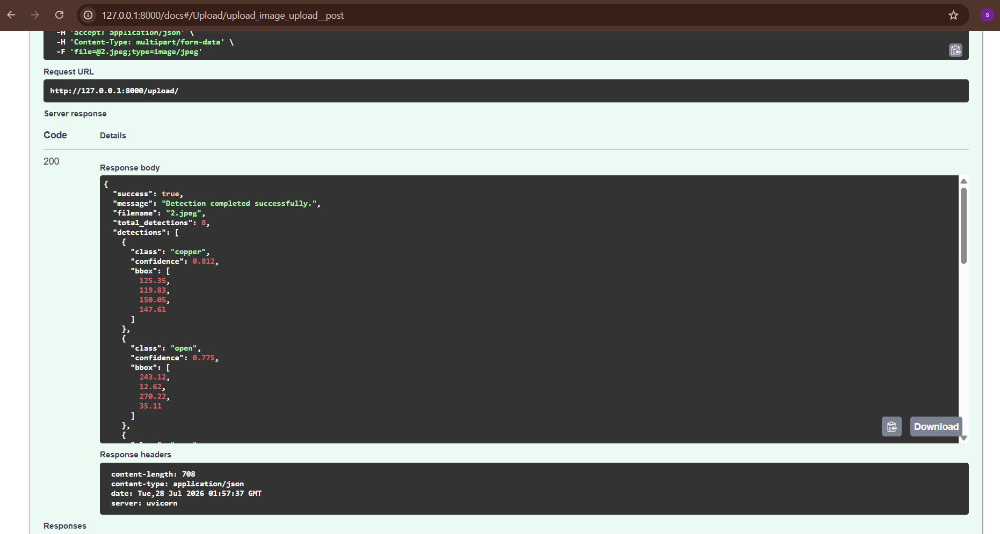
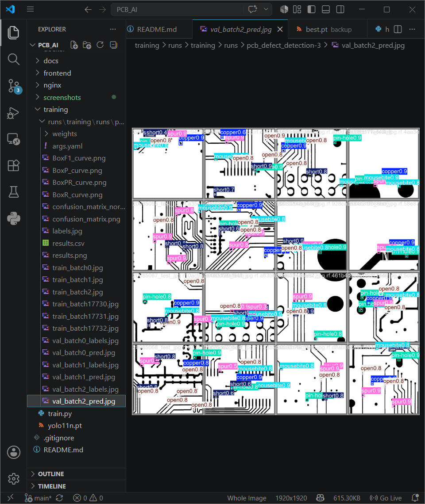
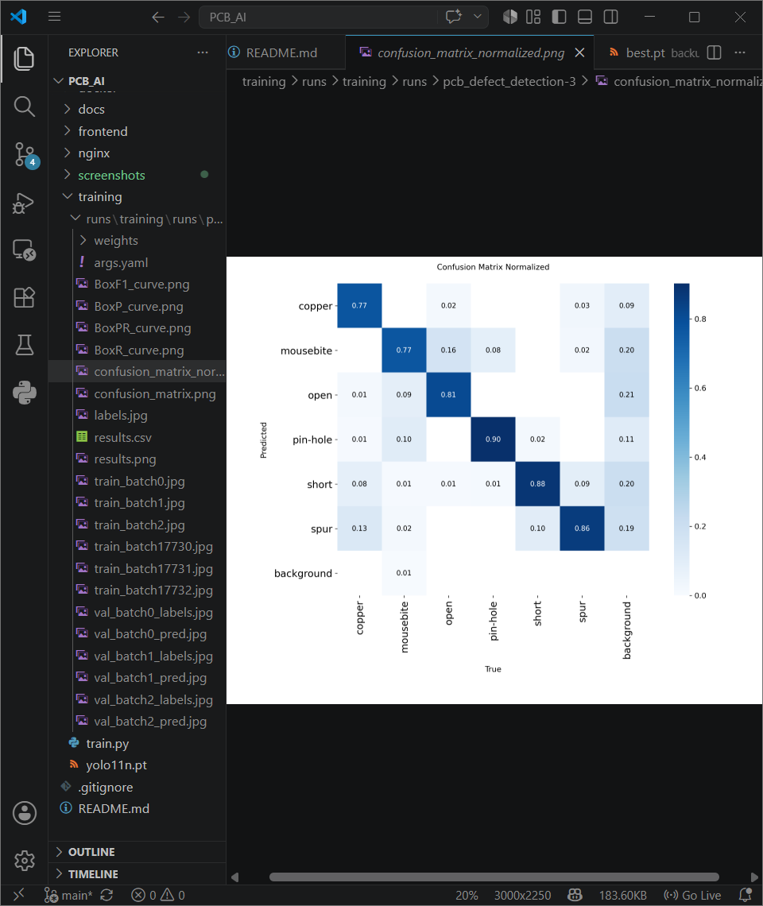

# 🤖 AI-Powered PCB Defect Detection and Repair Recommendation System

An end-to-end AI-powered web application for detecting Printed Circuit Board (PCB) defects using **YOLO11**, providing **repair recommendations**, and generating inspection reports through a modern web interface.

---

## 🚀 Project Overview

This project uses a custom-trained YOLO11 object detection model to automatically identify defects in PCB images. Users can upload an image through a web application, receive detected defects with confidence scores, and view recommended repair actions.

The system is designed to reduce manual inspection time and improve PCB quality assurance by leveraging deep learning and computer vision.

---

## ✨ Features

- 🔍 PCB defect detection using a custom YOLO11 model
- 📷 Upload PCB images for analysis
- 📦 Bounding box visualization with confidence scores
- 🛠️ Repair recommendation for each detected defect
- ⚡ FastAPI backend for high-performance inference
- 🧠 DeepPCB dataset-based model training
- 📄 PDF inspection report generation *(Upcoming)*
- 🌐 React-based responsive frontend *(Upcoming)*

---

## 🛠️ Tech Stack

| Category | Technology |
|----------|------------|
| Backend | FastAPI |
| Deep Learning | YOLO11 (Ultralytics) |
| Framework | PyTorch |
| Image Processing | OpenCV |
| Frontend | React + Vite *(Upcoming)* |
| Language | Python |
| Version Control | Git & GitHub |
---

## 📂 Project Structure

```text
PCB_AI/
│
├── backend/
│   ├── app/
│   │   ├── api/
│   │   ├── core/
│   │   ├── models/
│   │   ├── services/
│   │   └── main.py
│   │
│   ├── uploads/
│   └── requirements.txt
│
├── training/
│   ├── dataset/
│   ├── runs/
│   └── train.py
│
├── README.md
└── .gitignore
```
---

## 📊 Model Performance

The object detection model was trained on the **DeepPCB** dataset using **YOLO11**.

### Detection Capabilities

- Missing Hole
- Mouse Bite
- Open Circuit
- Short Circuit
- Spur
- Spurious Copper

The trained model is integrated into the FastAPI backend for real-time inference.

---

## 📸 Screenshots

### Swagger API



### Detection Result



### API Response



### Training Results



### Confusion Matrix



---

## 🔮 Future Enhancements

- User authentication
- Detection history
- PDF report generation
- PCB repair recommendation engine
- Cloud deployment
- Live camera inspection
- Batch image processing

